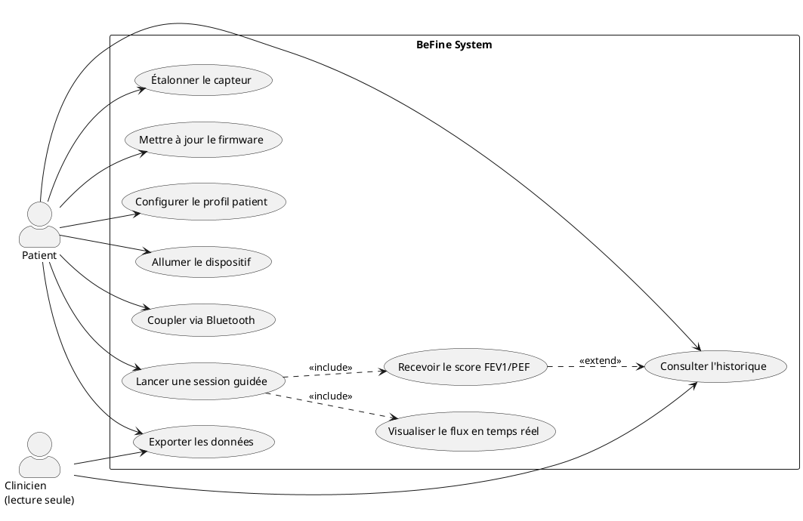
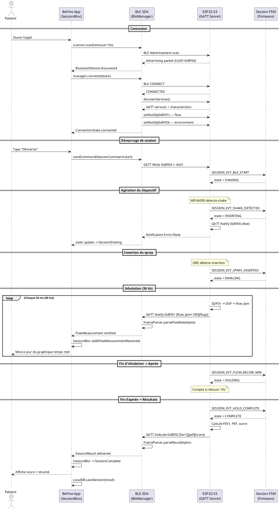
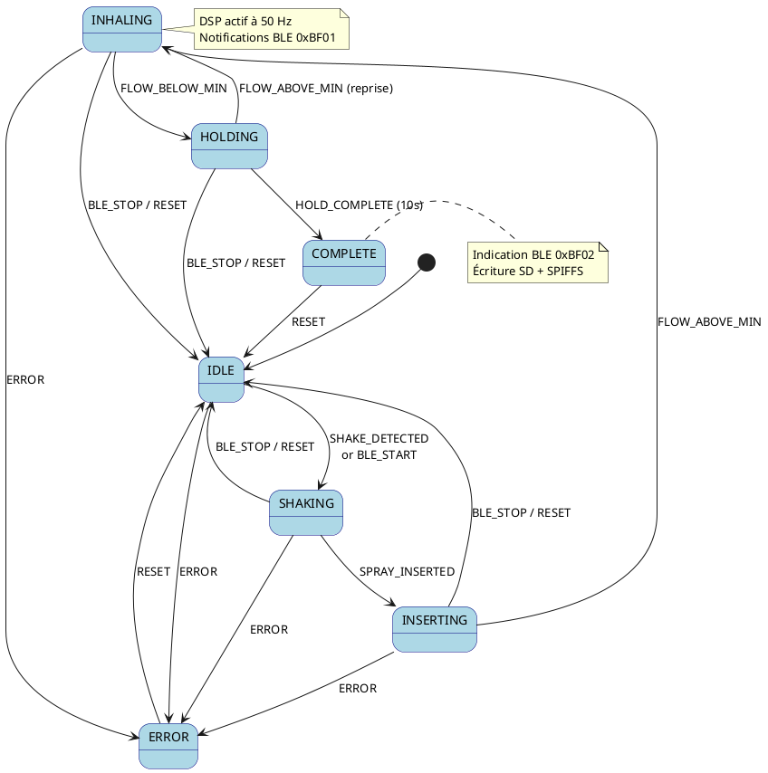
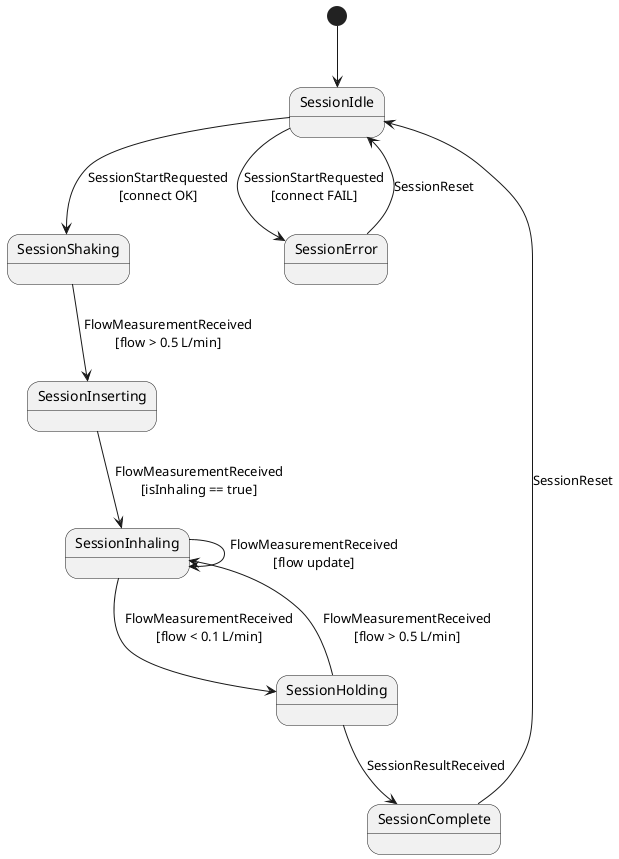
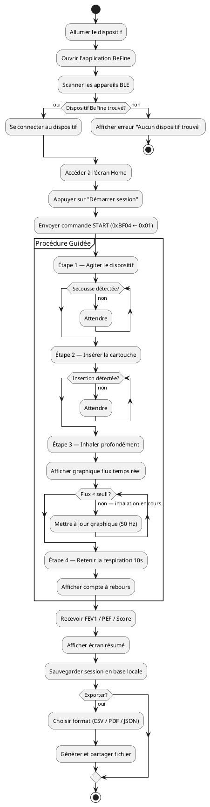

# BeFine — Plan de Travail Détaillé

> Ordre de livraison: Conception UML → Firmware ESP32-S3 → Application Flutter

---

## Phase 0 — Conception & Diagrammes UML

Avant toute ligne de code, les diagrammes servent de contrat entre le firmware, le SDK BLE et l'application. Chaque diagramme est livré en PlantUML (`.puml`) dans `docs/uml/`.

---

### 0.1 Diagramme de Cas d'Utilisation (Use Case)

```
docs/uml/use_case.puml
```



---

### 0.2 Diagramme de Classes (Class Diagram)

Deux niveaux : domaine partagé (contrat GATT) et architecture Flutter.

```plantuml
@startuml class_diagram
skinparam classAttributeIconSize 0

' ── GATT Domain ────────────────────────────────────────────────
package "Shared Domain (GATT Contract)" {
  class FlowMeasurement {
    + flowLpm : float
    + isInhaling : bool
    + isExhaling : bool
    + timestamp : DateTime
  }

  class EnvironmentData {
    + temperatureC : float
    + humidityPct : float
    + timestamp : DateTime
  }

  class SessionResult {
    + sessionId : int
    + fev1L : float
    + pefLpm : float
    + qualityScore : ScoreGrade
    + durationMs : int
    + timestampUnix : int
  }

  enum ScoreGrade { A; B; C; F }
  SessionResult --> ScoreGrade
}

' ── BLE SDK ────────────────────────────────────────────────────
package "befine_ble_sdk" {
  class BleManager {
    - policy : ReconnectPolicy
    - _flowController : StreamController
    - _envController : StreamController
    + flowStream : Stream<FlowMeasurement>
    + environmentStream : Stream<EnvironmentData>
    + connectionStream : Stream<ConnectionState>
    + connect(device) : Future<void>
    + sendCommand(cmd) : Future<void>
    + dispose() : Future<void>
  }

  class ReconnectPolicy {
    + maxAttempts : int
    + initialDelay : Duration
    + backoffFactor : double
    + delayFor(attempt) : Duration
  }

  abstract class FrameParser {
    + {static} parseFlowRate(bytes) : FlowMeasurement
    + {static} parseEnvironment(bytes) : EnvironmentData
    + {static} parseResult(bytes) : SessionResult
  }

  class BleScanner {
    + scan(timeout) : Future<List<BluetoothDevice>>
  }

  BleManager --> ReconnectPolicy
  BleManager ..> FrameParser : uses
  BleManager --> FlowMeasurement : emits
  BleManager --> EnvironmentData : emits
}

' ── App Domain ──────────────────────────────────────────────────
package "befine_app (Domain)" {
  interface SessionRepository {
    + startSession(deviceId) : Future<Either<Failure,Session>>
    + endSession(id) : Future<Either<Failure,SessionResult>>
    + flowMeasurements(id) : Stream<Either<Failure,FlowMeasurement>>
    + getHistory(range?) : Future<Either<Failure,List<Session>>>
  }

  class StartSession {
    - _repository : SessionRepository
    + call(deviceId) : Future<Either<Failure,Session>>
  }

  class EndSession {
    - _repository : SessionRepository
    + call(id) : Future<Either<Failure,SessionResult>>
  }

  StartSession --> SessionRepository
  EndSession   --> SessionRepository
}

' ── App Presentation ────────────────────────────────────────────
package "befine_app (Presentation)" {
  class SessionBloc {
    + state : SessionState
    - _flowSub : StreamSubscription
    + on<SessionStartRequested>()
    + on<FlowMeasurementReceived>()
    + on<SessionStopRequested>()
  }

  abstract class SessionState {}
  class SessionIdle extends SessionState {}
  class SessionShaking extends SessionState {}
  class SessionInhaling extends SessionState {
    + currentFlow : FlowMeasurement
  }
  class SessionHolding extends SessionState {}
  class SessionComplete extends SessionState {
    + result : SessionResult
  }
  class SessionError extends SessionState {}

  SessionBloc --> SessionState
  SessionBloc --> StartSession
  SessionBloc --> EndSession
}
@enduml
```

---

### 0.3 Diagramme de Séquence (Sequence Diagram)

**Scénario principal : session guidée complète**



---

### 0.4 Diagramme d'États (State Machine)

**Firmware — Session FSM**



**Flutter App — SessionBloc FSM**



---

### 0.5 Diagramme d'Activité (Activity Diagram)

**Flux d'une session guidée (vue utilisateur)**



---

## Phase 1 — Firmware ESP32-S3 (ESP-IDF)

> Ordre : infrastructure → drivers → DSP → FSM → BLE → stockage → power → tests

### Étape 1.1 — Setup projet ESP-IDF

- [ ] Créer le projet `idf.py create-project befine-firmware`
- [ ] Configurer `sdkconfig.defaults` (target esp32s3, BT enabled, PSRAM)
- [ ] Définir `partitions.csv` (nvs / otadata / app0 / app1 / spiffs)
- [ ] Créer `main/befine_config.h` avec toutes les constantes compile-time
- [ ] Créer `main/befine_main.c` : squelette `app_main()` + création des queues + lancement des tâches
- [ ] Vérifier `idf.py build` sans erreur

**Fichiers à livrer :**
```
ESP-IDF/
├── CMakeLists.txt
├── sdkconfig.defaults
├── partitions.csv
└── main/
    ├── CMakeLists.txt
    ├── befine_main.c
    └── include/befine_config.h
```

---

### Étape 1.2 — Composant `sensors`

- [ ] **I2C init** : configurer le bus I2C0 (GPIO21=SDA, GPIO22=SCL, 400 kHz) dans `befine_main.c`
- [ ] **SDP3x driver** (`sdp3x.c / sdp3x.h`)
  - `sdp3x_init()` — envoyer commande 0x3615 (continuous measurement)
  - `sdp3x_read_measurement()` — lire 9 bytes, vérifier CRC-8 (poly 0x31), décoder DP + temp
- [ ] **SHT41 driver** (`sht4x.c / sht4x.h`)
  - `sht4x_read()` — commande 0xFD, attendre 9 ms, lire 6 bytes, décoder temp + humidity
- [ ] **MPU-6050 driver** (`mpu6050.c / mpu6050.h`)
  - Init : écrire registre PWR_MGMT_1 (0x6B ← 0x00)
  - `mpu6050_is_shaking()` — lire accéléromètre, calculer magnitude, comparer au seuil NVS
- [ ] **sensor_task** (`sensors.c`) : tâche FreeRTOS 50 Hz, lit les 3 capteurs, envoie `sensor_data_t` sur `g_sensor_queue`
- [ ] **Tests Unity** : `test/test_sdp3x_crc.c` (mock I2C bytes, vérifier décodage)

---

### Étape 1.3 — Composant `dsp`

- [ ] **IIR Biquad** (`iir_filter.c / iir_filter.h`)
  - `iir_biquad_process(filter, x)` — Direct Form II Transposed
  - Coefficients pré-calculés pour LP Butterworth 2nd ordre fc=10 Hz, fs=50 Hz
- [ ] **Flow calculator** (`flow_calculator.c`)
  - `flow_from_pressure(dp_pa, calib_constant)` — formule de Bernoulli
  - `flow_integrate_fev1(samples, n, &fev1, &pef)` — intégration trapèze, FEV1 à t=1s (sample 50), PEF = max
  - Lire la constante de calibration depuis NVS au démarrage
- [ ] **Peak detector** (`peak_detector.c`) : fenêtre glissante, détection onset/offset
- [ ] **dsp_task** : reçoit depuis `g_sensor_queue`, applique filtre → conversion → envoi sur `g_dsp_queue`
- [ ] **Tests Unity** : `test/test_iir_filter.c` (réponse à un sinus 5 Hz vs 15 Hz), `test/test_flow_calc.c`

---

### Étape 1.4 — Composant `session`

- [ ] Définir `session_state_t` et `session_event_t` dans `session_fsm.h`
- [ ] Implémenter la **table de transition** `fsm_table[state][event]` dans `session_fsm.c`
- [ ] Implémenter chaque handler (`on_idle_shake`, `on_shake_insert`, `on_flow`, `on_hold_start`, `on_complete`, `on_error`, `on_reset`)
- [ ] `session_fsm_task` : bloque sur `xQueueReceive(g_session_queue)`, exécute transition, loggue `state_old → state_new`
- [ ] `session_fsm_post_event(evt)` : API publique thread-safe (depuis n'importe quelle tâche)
- [ ] **Tests Unity** : `test/test_session_fsm.c` — rejouer toutes les transitions valides + transitions invalides (expect LOGW, pas de crash)

---

### Étape 1.5 — Composant `bluetooth`

- [ ] **Init Bluedroid** (`ble_init.c`)
  - Activer NVS, init BT controller, init Bluedroid, enregistrer callbacks GATT + GAP
  - Configurer advertising data : UUID 0xBF00, device name "BeFine"
- [ ] **Profil GATT** (`gatt_profile.h`) — définir toutes les UUIDs et indices IDX_*
- [ ] **Table GATT** (`gatt_server.c`) — `esp_gatts_attr_db_t befine_gatt_db[]` avec tous les characteristics + CCCD
- [ ] **Handler write** : `handle_session_ctrl_write()` — dispatche vers `session_fsm_post_event()`
- [ ] **Notification scheduler** (`ble_notify.c`)
  - `gatt_notify_flow(flow_lpm, is_inhaling)` — encoder frame 3 bytes, appeler `esp_ble_gatts_send_indicate()`
  - `gatt_notify_environment(temp, humidity)` — frame 4 bytes
  - `gatt_indicate_result(fev1, pef, score)` — frame 9 bytes, Indicate (ACK)
- [ ] **ble_notify_task** : reçoit depuis `g_dsp_queue`, notifie si client subscribed (vérifier BIT dans `g_ble_events`)

---

### Étape 1.6 — Composant `display`

- [ ] **SSD1306 low-level** (`ssd1306.c`) : init I2C, `ssd1306_clear()`, `ssd1306_draw_string()`, `ssd1306_fill_rect()`, `ssd1306_flush()`
- [ ] **Écrans** :
  - `screen_idle.c` — logo + "Prêt" + niveau batterie
  - `screen_guided.c` — étapes numérotées (Agiter / Insérer / Inhaler / Retenir)
  - `screen_flow.c` — bargraph 100px, valeur numérique L/min
  - `screen_summary.c` — FEV1, PEF, grade (A/B/C/F)
- [ ] `display_update_state(state, ctx)` — appelé par la FSM après chaque transition
- [ ] **display_task** : 10 Hz, lit état courant, redessine l'écran

---

### Étape 1.7 — Composant `storage`

- [ ] **NVS** : fonctions `storage_read_calib()` / `storage_write_calib()` pour `zero_offset_pa` et `span_constant`
- [ ] **SPIFFS** : monter la partition, `session_record_save_metadata()` → JSON par session dans `/spiffs/session_<id>.json`
- [ ] **SD Card** : initialiser SPI (VSPI), FAT32 mount, `sd_storage_open_session()` → CSV header, `sd_storage_write_sample(ts_ms, flow_lpm)`, `sd_storage_close_session()`
- [ ] **storage_task** : reçoit `session_result_t` depuis `g_storage_queue`, écrit SPIFFS + SD de façon asynchrone

---

### Étape 1.8 — Composant `power_mgmt`

- [ ] Définir les 3 profils `esp_pm_config_t` (ACTIVE / IDLE / SLEEP)
- [ ] `power_mgmt_set_mode(mode)` — applique la config + ajuste luminosité OLED + intervalle BLE adv
- [ ] `power_mgmt_check_idle_timeout()` — appelé toutes les secondes, déclenche deep sleep après 5 min d'inactivité
- [ ] Configurer wakeup sources : GPIO (QRE insert) + RTC timer 30s

---

### Étape 1.9 — OTA

- [ ] Vérifier partition table (app0 / app1 / otadata)
- [ ] Implémenter service OTA minimal (réception via BLE write sur UUID dédié ou via `esp_https_ota`)
- [ ] Script Python `tools/ota_push.py` pour la ligne de production

---

### Étape 1.10 — Intégration firmware & tests finaux

- [ ] Tester le pipeline complet sur hardware : SDP31 → DSP → BLE Notify (vérifier avec nRF Connect)
- [ ] Vérifier la FSM sur hardware (log série)
- [ ] Mesurer la consommation en mode IDLE (objectif < 5 mA)
- [ ] Vérifier OTA avec mise à jour d'une version de test
- [ ] Passer `idf.py build` avec `-Werror` sans avertissements

---

## Phase 2 — Application Flutter (Monorepo)

> Ordre : infrastructure → SDK BLE → couche domaine → data → présentation → tests

### Étape 2.1 — Setup monorepo

- [ ] Créer la structure monorepo :
  ```
  BeFine/
  ├── melos.yaml
  ├── analysis_options.yaml
  ├── packages/befine_ble_sdk/
  └── apps/befine_app/
  ```
- [ ] Configurer `melos.yaml` (bootstrap, test, analyze scripts)
- [ ] `melos bootstrap` — vérifier que tout compile

---

### Étape 2.2 — Package `befine_ble_sdk`

#### 2.2.1 Modèles (immutables)
- [ ] `FlowMeasurement` — `flowLpm`, `isInhaling`, `isExhaling`, `timestamp`, `copyWith`, `==`, `hashCode`
- [ ] `EnvironmentData` — `temperatureC`, `humidityPct`, `timestamp`
- [ ] `SessionResult` — `fev1L`, `pefLpm`, `qualityScore`, `durationMs`
- [ ] `DeviceInfo` — `fwMajor`, `fwMinor`, `hwRev`, `batteryPct`

#### 2.2.2 Exceptions
- [ ] `ParseException` — `ParseException.malformedFrame(characteristic, expected, actual)`
- [ ] `BleException` — `BleException.connectionFailed()`, `.timeout()`, `.notSupported()`

#### 2.2.3 GATT Profile
- [ ] `BefineGattProfile` — constantes UUID `spirometryServiceUuid`, `flowRateUuid`, `environmentUuid`, etc.

#### 2.2.4 Frame Parser
- [ ] `FrameParser.parseFlowRate(bytes)` — ByteData zero-copy, vérifier length ≥ 3, décoder uint16 LE + flags
- [ ] `FrameParser.parseEnvironment(bytes)` — int16 LE temp + uint16 LE humidity
- [ ] `FrameParser.parseResult(bytes)` — 2× float32 + uint8 score
- [ ] **Tests unitaires** : `test/unit/frame_parser_test.dart` — cas nominaux + cas tronqués + edge cases

#### 2.2.5 Reconnect Policy
- [ ] `ReconnectPolicy` — `delayFor(attempt)` : backoff exponentiel + jitter

#### 2.2.6 BLE Manager
- [ ] `BleScanner.scan(timeout)` — filtrer sur UUID 0xBF00
- [ ] `BleManager.connect(device)` — connexion + découverte services + subscribe characteristics
- [ ] `_subscribeCharacteristics()` — flowChar + envChar `setNotifyValue(true)`, pipe vers StreamControllers
- [ ] `_scheduleReconnect()` — backoff via `ReconnectPolicy`
- [ ] `sendCommand(SessionCommand)` — écrire sur 0xBF04
- [ ] Streams publics : `flowStream`, `environmentStream`, `connectionStream`
- [ ] `dispose()` — annuler timer, fermer controllers, déconnecter
- [ ] **Tests d'intégration** : mock `FlutterBluePlus`, simuler bytes, vérifier stream output

#### 2.2.7 Export package
- [ ] `lib/befine_ble_sdk.dart` — barrel export
- [ ] `pubspec.yaml` — version 1.0.0, dépendances `flutter_blue_plus`, `dartz`
- [ ] `example/lib/main.dart` — exemple minimal de scan + connect + listen

---

### Étape 2.3 — App : Core

- [ ] **DI** : `injection_container.dart` — enregistrer `BleManager`, `BleScanner`, DataSources, Repositories, UseCases, BLoCs (get_it)
- [ ] **Router** : `app_router.dart` — `GoRouter` avec ShellRoute (bottom nav: Home / History / Settings) + routes modales (scan, session, summary, export)
- [ ] **Theme** : `app_theme.dart`, `color_scheme.dart`, `text_theme.dart` (design system cohérent)
- [ ] **Failures** : sealed class `Failure` → `BleFailure`, `StorageFailure`, `ParseFailure`
- [ ] **Config** : `AppConfig` — constantes (scan timeout, reconnect attempts, chart window, hold target)

---

### Étape 2.4 — Feature `device`

**Domain**
- [ ] Entity `Device` — `id`, `name`, `rssi`
- [ ] Repository abstrait `DeviceRepository`
- [ ] UseCases : `ScanDevices`, `ConnectDevice`, `DisconnectDevice`

**Data**
- [ ] `BleDeviceDataSource` — wraps `BleScanner` + `BleManager`
- [ ] `DeviceModel` — JSON serializable, `.toDomain()`
- [ ] `DeviceRepositoryImpl`

**Presentation**
- [ ] `DeviceBloc` + events + states (Scanning / Found / Connecting / Connected / Error)
- [ ] `ScanPage` — liste animée avec `RssiIndicator` (barres signal)
- [ ] `DeviceDetailPage` — info firmware, niveau batterie, bouton déconnecter

---

### Étape 2.5 — Feature `session`

**Domain**
- [ ] Entity `Session` — `id`, `deviceId`, `startedAt`, `flowStream`
- [ ] Repository abstrait `SessionRepository`
- [ ] UseCases : `StartSession`, `EndSession`, `GetActiveSession`

**Data**
- [ ] `SessionRepositoryImpl` — `startSession()` envoie BLE command + crée entrée Drift, `endSession()` reçoit `SessionResult` + persiste

**Presentation**
- [ ] `SessionBloc` — FSM Dart miroir du firmware : `Idle → Shaking → Inserting → Inhaling → Holding → Complete → Error`
- [ ] `GuidedSessionPage` — 4 étapes avec Lottie animations, transitions automatiques depuis le BLoC
- [ ] `FlowChartWidget` — `fl_chart` LineChart, fenêtre glissante 6s, 50 Hz updates
- [ ] `TechniqueScoreBadge` — badge couleur A (vert) / B (bleu) / C (orange) / F (rouge)
- [ ] `StepIndicator` — barre de progression 4 étapes
- [ ] `SessionSummaryPage` — FEV1, PEF, score, mini chart, bouton "Exporter"

---

### Étape 2.6 — Feature `history`

- [ ] `HistoryPage` — liste paginée des sessions, sparkline miniature par session (fl_chart)
- [ ] `SessionDetailPage` — graphique complet + métriques + bouton export
- [ ] `TrendChart` — vue hebdo/mensuelle de FEV1 et PEF
- [ ] UseCase `GetSessionHistory(range?)` — requête Drift avec filtre date
- [ ] Base Drift : table `sessions` + table `flow_samples`, relations

---

### Étape 2.7 — Feature `export`

- [ ] `ExportPage` — 3 boutons : CSV / PDF / JSON
- [ ] `CsvExporter` — écrire les `flow_samples` d'une session dans un fichier `.csv`
- [ ] `PdfExporter` — package `pdf` : page titre, tableau métriques, graphique (capture widget fl_chart)
- [ ] `JsonExporter` — sérialiser `Session` + `SessionResult` + `FlowMeasurement[]` en JSON structuré
- [ ] Partage via `share_plus`

---

### Étape 2.8 — Feature `settings`

- [ ] `SettingsPage` — profil patient (nom, âge, sexe, taille, poids pour valeurs de référence spirométriques), unités, rappels
- [ ] Persistance via `shared_preferences`
- [ ] Notifications de rappel via `flutter_local_notifications`

---

### Étape 2.9 — Tests Flutter

- [ ] `frame_parser_test.dart` — cas nominaux, frames tronquées, valeurs limites
- [ ] `reconnect_policy_test.dart` — vérifier backoff, cap maxDelay, jitter dans bornes
- [ ] `session_bloc_test.dart` — rejouer toutes les transitions d'état avec `bloc_test`
- [ ] `device_bloc_test.dart` — mock `DeviceRepository`, tester scan + connect
- [ ] Tests d'intégration (émulateur) : connexion BLE mock → session complète → sauvegarde → export

---

### Étape 2.10 — Polish & Publication

- [ ] `flutter analyze` — zéro avertissement
- [ ] `flutter test` — coverage > 80 % sur le SDK
- [ ] Préparer `CHANGELOG.md` v1.0.0 pour `befine_ble_sdk`
- [ ] `pub publish --dry-run` — vérifier score pub.dev
- [ ] Screenshots de l'app pour le README GitHub

---

## Phase 3 — CI / GitHub

### Étape 3.1 — Structure GitHub

```
GitHub Repository: befine
├── .github/
│   └── workflows/
│       ├── firmware.yml        # idf.py build + Unity tests
│       └── flutter.yml         # flutter analyze + flutter test (Android + iOS + Web)
├── ESP-IDF/                    # firmware
├── BeFine/                     # flutter monorepo
├── docs/
│   └── uml/                    # .puml files
├── Overview.md
└── WORK_PLAN.md
```

### Étape 3.2 — GitHub Actions

**Firmware CI** (`firmware.yml`) :
```yaml
on: [push, pull_request]
jobs:
  build:
    runs-on: ubuntu-latest
    steps:
      - uses: espressif/esp-idf-ci-action@v1
        with:
          esp_idf_version: v5.2.1
          target: esp32s3
          command: idf.py build && cd test && idf.py build
```

**Flutter CI** (`flutter.yml`) :
```yaml
on: [push, pull_request]
jobs:
  test:
    runs-on: ubuntu-latest
    steps:
      - uses: subosito/flutter-action@v2
        with: { flutter-version: '3.22.0' }
      - run: dart pub global activate melos
      - run: melos bootstrap
      - run: melos run analyze
      - run: melos run test
```

---

## Récapitulatif des livrables

| Phase | Livrable | Technologie |
|---|---|---|
| 0 | 5 diagrammes UML (`.puml`) | PlantUML |
| 1.1 | Squelette projet + config | ESP-IDF CMake |
| 1.2 | Drivers SDP3x, SHT4x, MPU6050 | C / I2C |
| 1.3 | Pipeline DSP (IIR + flow calc + FEV1) | C / DSP |
| 1.4 | Session FSM | C / FreeRTOS |
| 1.5 | GATT Server BLE | C / Bluedroid |
| 1.6 | Display OLED (4 écrans) | C / I2C |
| 1.7 | Stockage NVS + SPIFFS + SD | C / ESP-IDF |
| 1.8 | Power management | C / esp_pm |
| 1.9 | OTA | C / ESP-IDF OTA |
| 2.1 | Setup monorepo Melos | Dart / Flutter |
| 2.2 | `befine_ble_sdk` (pub.dev) | Dart |
| 2.3 | Core app (DI, router, theme) | Flutter |
| 2.4 | Feature device (scan + connect) | Flutter / BLoC |
| 2.5 | Feature session (procédure guidée) | Flutter / BLoC |
| 2.6 | Feature history + DB | Flutter / Drift |
| 2.7 | Feature export (CSV/PDF/JSON) | Flutter |
| 2.8 | Feature settings | Flutter |
| 2.9 | Tests unitaires + intégration | flutter_test / Unity |
| 3 | CI GitHub Actions | YAML |

---

## Ordre de commit recommandé (GitHub)

Chaque commit correspond à une étape complète et autonome :

```
feat(firmware): project scaffold, sdkconfig, partition table
feat(firmware): SDP3x I2C driver with CRC-8 validation
feat(firmware): SHT41 and MPU6050 drivers + sensor_task 50Hz
feat(firmware): DSP pipeline — IIR filter, flow conversion, FEV1 integration
feat(firmware): session FSM with FreeRTOS event queue
feat(firmware): BLE GATT server — service 0xBF00, notifications, write handler
feat(firmware): SSD1306 OLED driver and 4 session screens
feat(firmware): SPIFFS and SD card session storage
feat(firmware): power management profiles and idle deep sleep
feat(firmware): OTA dual-partition support
feat(sdk): befine_ble_sdk — models, frame parser, reconnect policy
feat(sdk): BleManager — connect, streams, auto-reconnect, sendCommand
feat(app): monorepo setup, melos, core DI and router
feat(app): device feature — scan page, DeviceBloc, BLE connect
feat(app): session feature — GuidedSessionPage, SessionBloc FSM, FlowChartWidget
feat(app): history feature — HistoryPage, TrendChart, Drift database
feat(app): export feature — CSV, PDF, JSON exporters
feat(app): settings feature — patient profile, reminders
test: unit and integration tests for SDK and app
ci: GitHub Actions for firmware build and flutter test
docs: UML diagrams (use case, class, sequence, state, activity)
```
